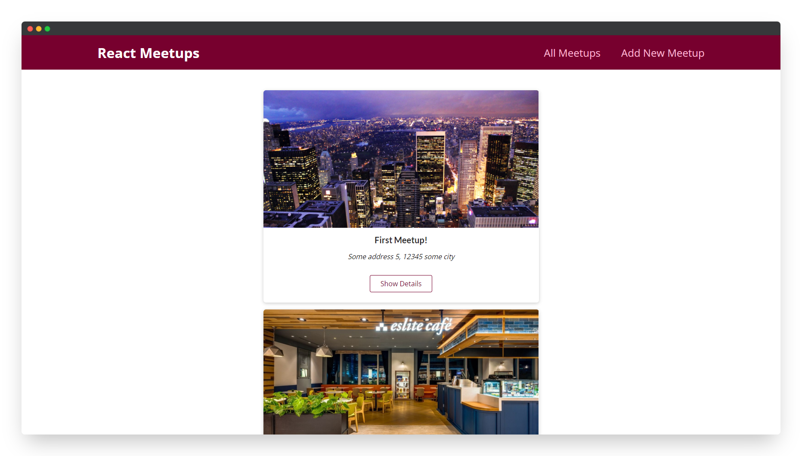
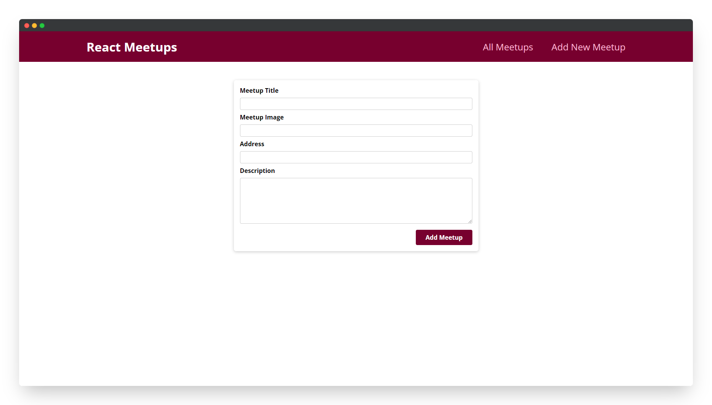

<!--
*** Thanks for checking out the nextjs-meetups. If you have a suggestion
*** that would make this better, please fork the repo and create a pull request
*** or simply open an issue with the tag "enhancement".
*** Thanks again! Now go create something AMAZING! :D
***
*** To avoid retyping too much info. Do a search and replace for the following:
*** github_username (that is "windsuzu"), repo_name (that is "nextjs-meetups"), project_title, project_description
-->

<!-- [![Issues][issues-shield]][issues-url] -->
<!-- [![PR Welcome][pr-welcome-shield]](#contributing) -->
[![Contributors][contributors-shield]][contributors-url]
[![MIT License][license-shield]][license-url]
[![Author][author-shield]][author-url]
[![LinkedIn][linkedin-shield]][linkedin-url]


<!-- PROJECT LOGO -->
<br />
<p align="center">
  <a href="http://nextjs-meetups-pearl.vercel.app/">
    
  </a>

  <h3 align="center">NEXT.js Demo - A Meetups Website</h3>

  <p align="center">
    An example of a meetups website built with NEXT.js. <br>Its purpose is to demonstrate SSG/SSR, file-based routing, and backend API routes.
    <br />
    <a href="http://nextjs-meetups-pearl.vercel.app/">View Demo</a>
    ·
    <a href="https://github.com/windsuzu/nextjs-meetups/issues">Report Bug</a>
    ·
    <a href="https://github.com/windsuzu/nextjs-meetups/issues">Request Feature</a>
  </p>
</p>


<details>
<summary>Table of Contents</summary>

* [About](#about)
* [Examples](#examples)
  * [🖼️ Layout](#️-layout)
  * [📂 File-based Routing](#-file-based-routing)
    * [basic routing](#basic-routing)
    * [nested-routes](#nested-routes)
    * [dynamic routes & extract url parameters](#dynamic-routes--extract-url-parameters)
    * [Link & imperative navigation](#link--imperative-navigation)
  * [🤫 Static Site Generation (SSG)](#-static-site-generation-ssg)
  * [🤗 Server-Side Rendering (SSR)](#-server-side-rendering-ssr)
  * [🔖 API Route](#-api-route)
  * [🔒 Environment Variables](#-environment-variables)
* [Preview](#preview)
* [License](#license)
* [Contact](#contact)
* [Acknowledgements](#acknowledgements)

</details>

---

<!-- ABOUT THE PROJECT -->
## About

<table>
<tr>
<td>

這個專案用來記錄 NEXT.js 基本的特色與架構寫法，例如以文件目錄系統作為路由管理 (file-based routing)、SSG (static site generation) 和 SSR (server-side rendering) 的實作，以及利用 API route 處理後端相關請求。

**Built With**

* HTML5, CSS3, Javascript ES6
* React.js
* NEXT.js

**[DEMO]** : http://nextjs-meetups-pearl.vercel.app/

</td>
</tr>
</table>

---

## Examples

### 🖼️ Layout

我們可以用 [_app.js](https://github.com/windsuzu/nextjs-meetups/blob/43f89b08a5ace4950ebd1779f9c4f1bb6237425e/pages/_app.js) 進行全局設定。除了可以在 [_app.js](https://github.com/windsuzu/nextjs-meetups/blob/43f89b08a5ace4950ebd1779f9c4f1bb6237425e/pages/_app.js) 放入定義好的 `globals.css` 外，因為裡面的 `<Component />` 代表每一個頁面，所以將 `<Layout>` 包住 `<Component />` 可以將 `<Layout>` 的設定作用在每一個頁面上。

### 📂 File-based Routing

#### basic routing

將檔案放在 `pages` 資料夾底下就可以在對應的 URL 看到該檔案的頁面。

```
/pages/index.js    => localhost/
/pages/welcome.js  => localhost/welcome
```
---

#### nested-routes

在建立 `pages` 底下建立另外的資料夾，就可以建立**巢狀 URL**。

```
/pages/meetup/index.js  => localhost/meetup/
/pages/meetup/other.js  => localhost/meetup/other
```
---

#### dynamic routes & extract url parameters

將檔案名用中括號 `[]` 包覆，中間填入的名稱 (e.g.`meetupId`) 會作為**網址參數 (url params)** 被使用。

```
/pages/[meetupId]/index.js  => localhost/123
                            => localhost/234
                            => ...

# is equal to 
# /pages/[meetupId].js
```

有兩種方式可以取得 URL 上的參數，一個是透過在 component 中使用 `useRouter`；另一個是透過在 SSG/SSR 中使用 `context.params` 取得。

1. useRouter

``` js
// localhost/123
const router = useRouter();
console.log(router.query.meetupId);  // 123
```

2. Context.params (e.g. [MeetupDetailPage](https://github.com/windsuzu/nextjs-meetups/blob/main/pages/%5BmeetupId%5D/index.js#L23-L24))

``` js
// localhost/123
export const getStaticProps = async (ctx) => {
  const meetupId = ctx.params.meetupId; // 123
} 
```

---

#### Link & imperative navigation

* [Link as `<a href>`](https://github.com/windsuzu/nextjs-meetups/blob/main/components/layout/MainNavigation.js#L10-L15)
* [Link with button and passHref](https://github.com/windsuzu/nextjs-meetups/blob/main/components/meetups/MeetupItem.js#L17-L19)
* [Navigate Programmatically](https://github.com/windsuzu/nextjs-meetups/blob/main/pages/new-meetup/index.js#L19)

---

### 🤫 Static Site Generation (SSG)

> SSG 會在 build time 就透過 API 取得資料，並建立好靜態頁面。伺服器在之後收到 request 時會重複使用這些已經生成好的靜態頁面。若你認為頁面可以在瀏覽器發送請求前就先產生好，並且不會常常改變，推薦使用 SSG。

* [getStaticProps](https://github.com/windsuzu/nextjs-meetups/blob/main/pages/%5BmeetupId%5D/index.js#L23-L46) 會在伺服器端執行，可以抓取 API 資料，並回傳 props 給 component。另外擁有 context 參數可以獲得 req, res 資訊。
* [getStaticPaths](https://github.com/windsuzu/nextjs-meetups/blob/main/pages/%5BmeetupId%5D/index.js#L48-L65) 用來定義動態路由可能會產生的路徑 (URLs)，解決動態路由可能有無限種可能的路徑。
  * fallback 解決用戶遇到無定義在 getStaticPaths 的路由時
    * `false` 會直接顯示 404 Not Found
    * `true` 會馬上顯示空白頁面，並試著去載入正確頁面
    * `"blocking"` 會卡在原本頁面，等到載入成功才顯示正確頁面

### 🤗 Server-Side Rendering (SSR)

> SSR 指的是伺服器在每次收到請求時，就會重新產生對應的靜態頁面。除非你的頁面的資料會有頻繁的更新，且內容會根據每次的請求而有不同時，在這種情況下才選擇使用 SSR。

* [getServerSideProps](https://github.com/windsuzu/nextjs-meetups/blob/main/pages/index.js#L28-L47) 做法和 SSG 相同，只是會在收到每次的 request 後都重新渲染。

### 🔖 API Route

NEXT.js 提供編寫後端程式碼的功能，只要在 `/pages/api/` 底下建立後端 API 功能，就可以在任何前端的 component 呼叫該 API。API 一樣會根據 `/pages/api/` 的架構建立 URL 連結。

```
/pages/api/new-meetup.js  => localhost/api/new-meetup
```

* [Backend [POST /api/new-meetup]](https://github.com/windsuzu/nextjs-meetups/blob/43f89b08a5ace4950ebd1779f9c4f1bb6237425e/pages/api/new-meetup.js#L10)
* [Frontend [fetch("/api/new-meetup")]](https://github.com/windsuzu/nextjs-meetups/blob/main/pages/new-meetup/index.js#L9-L20)

### 🔒 Environment Variables

NEXT.js 可以在 `next.config.js` 或 `vercel` 定義環境變數:

``` js
const nextConfig = {
    ...
    env: {
        MONGODB_ACCOUNT: "XXXXX",
        MONGODB_PWD: "XXXXXXXX",
        MONGODB_COLLECTION: "XXXXX",
    },
};

module.exports = nextConfig;
```

並且通過 `process.env.MONGODB_ACCOUNT` 取得該變數。

## Preview

<p align="center">
  
  
</p>

## License

Distributed under the MIT License. See [LICENSE](https://github.com/windsuzu/nextjs-meetups/blob/main/LICENSE) for more information.

## Contact

Reach out to the maintainer at one of the following places:

* [GitHub discussions](https://github.com/windsuzu/nextjs-meetups/discussions)
* The email which is located [in GitHub profile](https://github.com/windsuzu)

## Acknowledgements

* [Maximilian Schwarzmüller](https://www.udemy.com/user/maximilian-schwarzmuller/)

[contributors-shield]: https://img.shields.io/github/contributors/windsuzu/nextjs-meetups.svg?style=for-the-badge
[contributors-url]: https://github.com/windsuzu/nextjs-meetups/graphs/contributors
[issues-shield]: https://img.shields.io/github/issues/windsuzu/nextjs-meetups.svg?style=for-the-badge
[issues-url]: https://github.com/windsuzu/nextjs-meetups/issues
[license-shield]: https://img.shields.io/github/license/windsuzu/nextjs-meetups.svg?style=for-the-badge&label=license
[license-url]: https://github.com/windsuzu/nextjs-meetups/blob/main/LICENSE
[linkedin-shield]: https://img.shields.io/badge/-LinkedIn-black.svg?style=for-the-badge&logo=linkedin&colorB=555
[linkedin-url]: https://linkedin.com/in/windsuzu
[pr-welcome-shield]: https://shields.io/badge/PRs-Welcome-ff69b4?style=for-the-badge
[author-shield]: https://shields.io/badge/Made_with_%E2%9D%A4_by-windsuzu-F4A92F?style=for-the-badge
[author-url]: https://github.com/windsuzu
